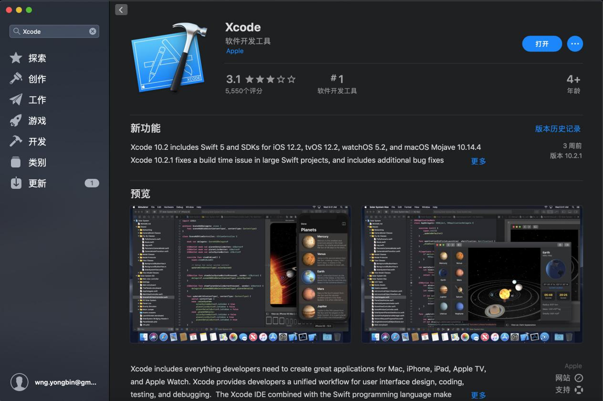
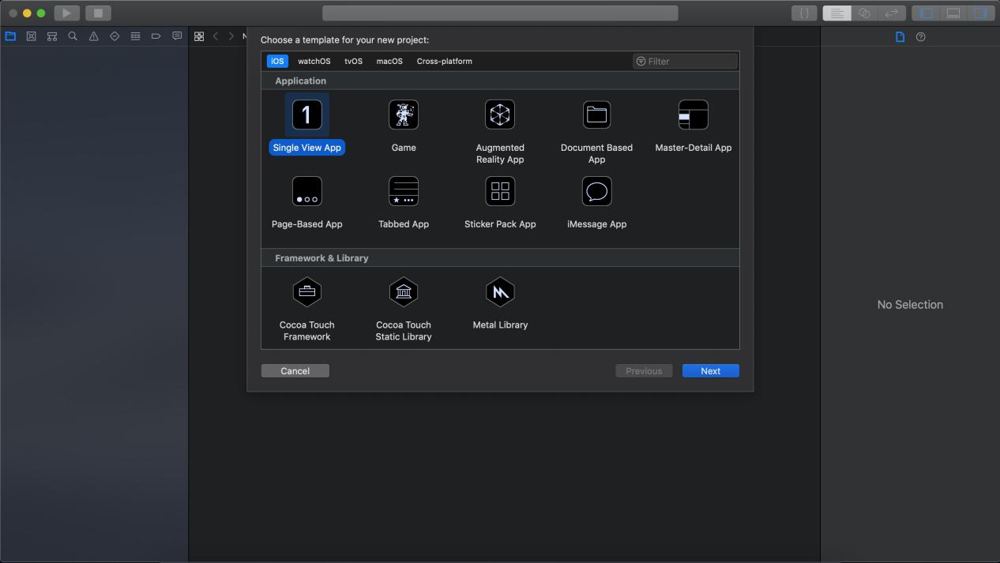
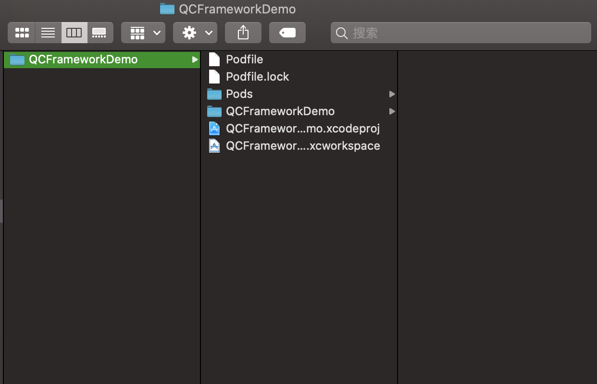
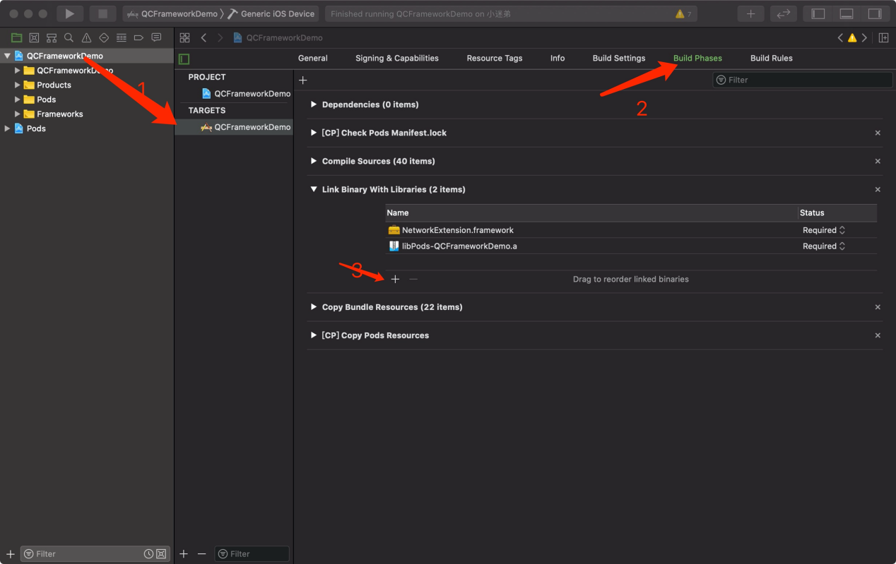
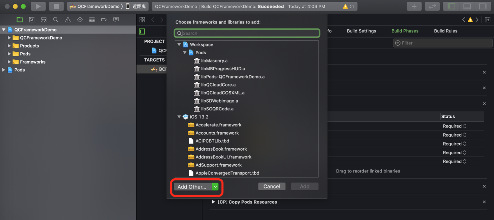
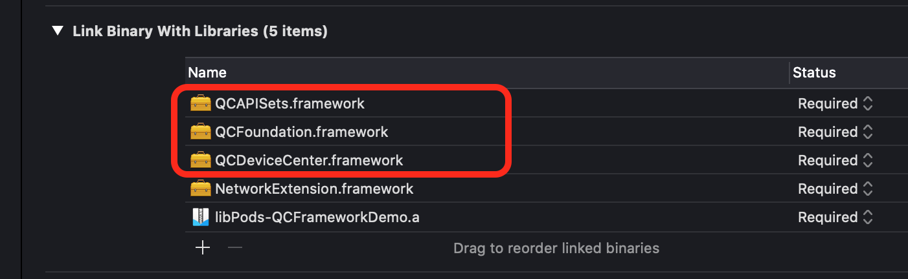

使用指南

概述
====

本章介绍sdk的集成和使用。

整套包含如下三个包：

-   基础SDK QCFoundation.framework

-   配网SDK QCDeviceCenter.framework

-   API集合 QCAPISets.framework

快速入门
========

开发前准备
----------

-   获取appKey

-   下载所需SDK

安装工具
--------

-   打开 AppStore 应用，安装 Xcode

集成SDK
-------

-   新建 Xcode 工程

-   将解压后的包拷贝至工程文件夹下

-   打开工程，左侧目录选中工程名，在 TARGETS-\>Build Phases-\> Link Binary With
    Libaries 中点击“+”按钮

-   在弹出的窗口中点击“Add Other”按钮，选择工程目录下的这几个文件添加到工程中

添加后的正确配置如下：

开始使用
--------

-   打开 AppDelegate.m 文件,引入基础SDK头文件\#import
    \<QCFoundation/QCFoundation.h\>,并添加如下示例代码，配置之前获得的appKey

>   \- (**BOOL**)application:(UIApplication \*)application didFinishLaunchingWithOptions:(NSDictionary \*)launchOptions {  

>       // Override point for customization after application launch.  

>       [[QCServices shared] setAppKey:\@"您的Key"];  

>       **return** YES;  

>   }

-   可选择开启或关闭打印，以方便调试。

>   [QCServices shared].logEnable = YES;  

所有api于对应头文件内均有具体作用以及参数的描述，可根据需要使用.

SDK说明
=======

账户相关
--------

账户相关api均位于QCAPISets/QCAccountSet当中，提供以下功能：

1.  手机号邮箱注册

2.  登录登出

3.  密码操作

4.  用户信息操作

-   **邮箱注册**

>   /// 发送验证码到邮箱（用于邮箱注册）  

1.  \- (**void**)sendVerificationCodeWithEmail:(NSString \*)email success:(SRHandler)success failure:(FRHandler)failure;  

>    

>   /// 校验验证码（用于邮箱注册）  

>   /// \@param code 验证码  

1.  \- (**void**)checkVerificationCodeWithEmail:(NSString \*)email code:(NSString \*)code success:(SRHandler)success failure:(FRHandler)failure;  

>   /// 邮箱注册  

1.  \- (**void**)createEmailUserWithEmail:(NSString \*)email verificationCode:(NSString \*)code password:(NSString \*)password success:(SRHandler)success failure:(FRHandler)failure;

-   **手机号注册**

>   /// 发送验证码（用于手机号注册）  

>   /// \@param countryCode 国际区号，如中国大陆区号为86  

1.  \- (**void**)sendVerificationCodeWithCountryCode:(NSString \*)countryCode phoneNumber:(NSString \*)phoneNumber success:(SRHandler)success failure:(FRHandler)failure;  

>   /// 检验验证码（用于手机号注册）  

1.  \- (**void**)checkVerificationCodeWithCountryCode:(NSString \*)countryCode phoneNumber:(NSString \*)phoneNumber verificationCode:(NSString \*)verificationCode success:(SRHandler)success failure:(FRHandler)failure;  

>   /// 手机号注册  

>   /// \@param countryCode 国际区号，如中国大陆区号为86  

1.  \- (**void**)createPhoneUserWithCountryCode:(NSString \*)countryCode phoneNumber:(NSString \*)phoneNumber verificationCode:(NSString \*)verificationCode password:(NSString \*)password success:(SRHandler)success failure:(FRHandler)failure;

-   **登录登出**

>   /// 微信登录    

>   /// \@param code 同意微信授权返回的code    

1.  \- (**void**)signInByWechatWithCode:(NSString \*)code Success:(SRHandler)success failure:(FRHandler)failure;  

>   /// 手机号登录    

>   /// \@param countryCode 国际区号，如中国大陆区号为86    

1.  \- (**void**)signInWithCountryCode:(NSString \*)countryCode phoneNumber:(NSString \*)phoneNumber password:(NSString \*)password success:(SRHandler)success failure:(FRHandler)failure;    

>   /// 邮箱登录    

1.  \- (**void**)signInWithEmail:(NSString \*)email password:(NSString \*)password success:(SRHandler)success failure:(FRHandler)failure;    

>   /// 登出    

1.  \- (**void**)signOutOnSuccess:(SRHandler)success failure:(FRHandler)failure;

-   **邮箱重置密码**

>   /// 发送验证码（重置密码--邮箱方式）  

1.  \- (**void**)sendCodeForResetWithEmail:(NSString \*)email success:(SRHandler)success failure:(FRHandler)failure;  

>   /// 检验验证码（重置密码--邮箱方式）  

1.  \- (**void**)checkCodeForResetWithEmail:(NSString \*)email code:(NSString \*)code success:(SRHandler)success failure:(FRHandler)failure;  

>   /// 重置密码（邮箱方式）  

1.  \- (**void**)resetPasswordByEmail:(NSString \*)email verificationCode:(NSString \*)code password:(NSString \*)password success:(SRHandler)success failure:(FRHandler)failure;

-   **手机号重置密码**

>   /// 发送验证码（重置密码--手机号方式）  

>   /// \@param countryCode 国际区号，如中国大陆区号为86  

1.  \- (**void**)sendCodeForResetWithCountryCode:(NSString \*)countryCode phoneNumber:(NSString \*)phoneNumber success:(SRHandler)success failure:(FRHandler)failure;  

>   /// 检验验证码（重置密码--手机号方式）  

1.  \- (**void**)checkCodeForResetWithCountryCode:(NSString \*)countryCode phoneNumber:(NSString \*)phoneNumber verificationCode:(NSString \*)verificationCode success:(SRHandler)success failure:(FRHandler)failure;  

>   /// 重置密码（手机号方式）  

>   /// \@param countryCode 国际区号，如中国大陆区号为86  

1.  \- (**void**)ResetPasswordWithCountryCode:(NSString \*)countryCode phoneNumber:(NSString \*)phoneNumber verificationCode:(NSString \*)verificationCode password:(NSString \*)password success:(SRHandler)success failure:(FRHandler)failure;

-   **修改密码**

>   /// 修改密码  

>   /// \@param currentPassword 目前的密码  

>   /// \@param newPassword 新密码  

1.  \- (**void**)modifyPasswordWithCurrentPassword:(NSString \*)currentPassword newPassword:(NSString \*)newPassword success:(SRHandler)success failure:(FRHandler)failure;

-   **绑定手机号**

>   /// 发送验证码（绑定手机号）  

>   /// \@param countryCode 国际区号，如中国大陆区号为86  

1.  \- (**void**)sendCodeForBindWithCountryCode:(NSString \*)countryCode phoneNumber:(NSString \*)phoneNumber success:(SRHandler)success failure:(FRHandler)failure;  

>   /// 绑定手机号  

1.  \- (**void**)bindPhoneNumberWithCountryCode:(NSString \*)countryCode phoneNumber:(NSString \*)phoneNumber verificationCode:(NSString \*)verificationCode success:(SRHandler)success failure:(FRHandler)failure;

-   **用户信息**

>   /// 获取用户信息  

1.  \- (**void**)getUserInfoOnSuccess:(SRHandler)success failure:(FRHandler)failure;  

>    

>   /// 获取上传cos的必要参数的必要参数  

1.  \- (**void**)getUploadInfoOnSuccess:(SRHandler)success failure:(FRHandler)failure;  

>   /// 修改用户信息  

>   /// \@param nickName 昵称(不修改时传\@"")  

>   /// \@param avatar 头像(不修改时传\@"")  

1.  \- (**void**)updateUserWithNickName:(NSString \*)nickName avatar:(NSString \*)avatar success:(SRHandler)success failure:(FRHandler)failure;

-   **意见反馈**

>   /// 意见反馈  

>   /// \@param text 反馈文本内容  

>   /// \@param contact 联系方式（不填时传\@""）  

>   /// \@param urls 图片地址  

1.  \- (**void**)setFeedbackWithText:(NSString \*)text contact:(NSString \*)contact imageURLs:(NSArray\<NSString \*\> \*)urls success:(SRHandler)success failure:(FRHandler)failure;

家庭相关
--------

家庭相关api位于QCAPISets/QCFamilySet，提供以下功能：

1.  家庭操作

2.  房间操作

3.  家庭成员操作

-   **家庭**

>   /// 获取家庭列表  

>   /// \@param offset 非必传（忽略时传0），所需要查询的数据的偏移量  

>   /// \@param limit 非必传（忽略时传0），所需要查询的总限制量，最大返回 50 条  

1.  \- (**void**)getFamilyListWithOffset:(NSUInteger)offset limit:(NSUInteger)limit success:(SRHandler)success failure:(FRHandler)failure;  

>    

>   /// 创建家庭  

>   /// \@param name 家庭名  

>   /// \@param address 家庭地址  

1.  \- (**void**)createFamilyWithName:(NSString \*)name address:(NSString \*)address success:(SRHandler)success failure:(FRHandler)failure;  

>   /// 获取家庭详情  

1.  \- (**void**)getFamilyInfoWithFamilyId:(NSString \*)familyId success:(SRHandler)success failure:(FRHandler)failure;  

>   /// 修改家庭信息  

>   /// \@param name 家庭名  

1.  \- (**void**)modifyFamilyWithFamilyId:(NSString \*)familyId name:(NSString \*)name success:(SRHandler)success failure:(FRHandler)failure;  

>   /// 删除家庭  

1.  \- (**void**)deleteFamilyWithFamilyId:(NSString \*)familyId name:(NSString \*)name success:(SRHandler)success failure:(FRHandler)failure;

-   **房间**

>   /// 获取房间列表  

>   /// \@param offset 非必传，所需要查询的数据的偏移量  

>   /// \@param limit 非必传，所需要查询的总限制量，最大返回 50 条  

1.  \- (**void**)getRoomListWithFamilyId:(NSString \*)familyId offset:(NSUInteger)offset limit:(NSUInteger)limit  success:(SRHandler)success failure:(FRHandler)failure;  

>   /// 创建房间  

>   /// \@param name 房间名  

1.  \- (**void**)createRoomWithFamilyId:(NSString \*)familyId name:(NSString \*)name success:(SRHandler)success failure:(FRHandler)failure;  

>   /// 删除房间  

1.  \- (**void**)deleteRoomWithFamilyId:(NSString \*)familyId roomId:(NSString \*)roomId success:(SRHandler)success failure:(FRHandler)failure;  

>   /// 修改房间信息  

>   /// \@param name 房间名  

1.  \- (**void**)modifyRoomWithFamilyId:(NSString \*)familyId roomId:(NSString \*)roomId name:(NSString \*)name success:(SRHandler)success failure:(FRHandler)failure;

-   **成员**

>   /// 成员主动退出家庭  

1.  \- (**void**)leaveFamilyWithFamilyId:(NSString \*)familyId success:(SRHandler)success failure:(FRHandler)failure;  

>    

>   /// 家主删除家庭成员  

1.  \- (**void**)deleteFamilyMemberWithFamilyId:(NSString \*)familyId memberId:(NSString \*)memberId success:(SRHandler)success failure:(FRHandler)failure;  

>   /// 获取家庭成员列表  

>   /// \@param offset 非必传，所需要查询的数据的偏移量  

>   /// \@param limit 非必传，所需要查询的总限制量，最大返回 50 条  

1.  \- (**void**)getMemberListWithFamilyId:(NSString \*)familyId offset:(NSUInteger)offset limit:(NSUInteger)limit success:(SRHandler)success failure:(FRHandler)failure;  

>    

>   /// 邀请家庭成员（手机号账户）  

1.  \- (**void**)sendInvitationToPhoneNum:(NSString \*)phoneNum withCountryCode:(NSString \*)countryCode familyId:(NSString \*)familyId success:(SRHandler)success failure:(FRHandler)failure;  

>   /// 邀请家庭成员（邮箱账户）  

1.  \- (**void**)sendInvitationToEmail:(NSString \*)email withFamilyId:(NSString \*)familyId success:(SRHandler)success failure:(FRHandler)failure;  

>   /// 加入家庭  

1.  \- (**void**)joinFamilyWithShareToken:(NSString \*)shareToken success:(SRHandler)success failure:(FRHandler)failure;

消息相关
--------

消息相关api位于QCAPISets/QCMessageSet，提供如下能力：

1.  消息操作

2.  移动推送token的绑定解绑

-   **消息**

>   /// 获取消息  (1设备，2家庭，3通知 )

>   /// \@param msgId 已获取最后一条的消息id，首次可不传  

>   /// \@param msgTimestamp 消息的时间戳，首次可不传或传 0  

>   /// \@param limit 最大返回条数，最大不超过100  

>   /// \@param category 主类型，1设备，2家庭，3通知  

1.  \- (**void**)getMessagesWithMsgId:(NSString \*)msgId msgTimestamp:(SInt64)msgTimestamp limit:(NSUInteger)limit category:(NSUInteger)category success:(SRHandler)success failure:(FRHandler)failure;  

>   /// 删除消息  

1.  \- (**void**)deleteMessageByMsgId:(NSString \*)msgId success:(SRHandler)success failure:(FRHandler)failure;

-   **移动推送**

>   /// 绑定移动推送token  

1.  \- (**void**)bindXgToken:(NSString \*)token success:(SRHandler)success failure:(FRHandler)failure;  

>    

>   /// 解绑移动推送token  

1.  \- (**void**)unbindXgToken:(NSString \*)token success:(SRHandler)success failure:(FRHandler)failure;

设备相关
--------

设备相关api位于QCAPISets/QCDeviceSet，提供以下能力：

1.  设备信息获取与控制

2.  云端定时

3.  设备分享

-   **设备信息获取与控制**

>   /// 注册设备监听（调用成功后才能收到deviceChange）  

1.  \- (**void**)activePushWithDeviceIds:(NSArray \*)deviceIds complete:(Result)result;  

>   /// 获取设备列表  

>   /// \@param offset 非必传（忽略时传0），所需要查询的数据的偏移量  

>   /// \@param limit 非必传（忽略时传0），所需要查询的总限制量，最大返回 50 条  

1.  \- (**void**)getDeviceListWithFamilyId:(NSString \*)familyId roomId:(NSString \*)roomId offset:(NSUInteger)offset limit:(NSUInteger)limit success:(SRHandler)success failure:(FRHandler)failure;  

>   /// 获取产品配置  

1.  \- (**void**)getProductsConfigWithProductIds:(NSArray \*)productIds success:(SRHandler)success failure:(FRHandler)failure;  

>   /// 获取产品信息  

1.  \- (**void**)getProductsWithProductIds:(NSArray \*)productIds success:(SRHandler)success failure:(FRHandler)failure;  

>   /// 获取设备数据  

1.  \- (**void**)getDeviceDataWithProductId:(NSString \*)productId deviceName:(NSString \*)deviceName success:(SRHandler)success failure:(FRHandler)failure;  

>   /// 下发控制数据  

>   /// \@param data 需要下发的数据  

1.  \- (**void**)controlDeviceDataWithProductId:(NSString \*)productId deviceName:(NSString \*)deviceName data:(NSDictionary \*)data success:(SRHandler)success failure:(FRHandler)failure;  

>   /// 修改设备别名  

>   /// \@param aliasName 别名  

1.  \- (**void**)modifyAliasName:(NSString \*)aliasName ByProductId:(NSString \*)productId andDeviceName:(NSString \*)deviceName success:(SRHandler)success failure:(FRHandler)failure;  

>    

>   /// 解绑设备  

>   /// \@param productId 产品id  

>   /// \@param deviceName 设备名  

1.  \- (**void**)deleteDeviceWithFamilyId:(NSString \*)familyId productId:(NSString \*)productId andDeviceName:(NSString \*)deviceName success:(SRHandler)success failure:(FRHandler)failure;  

>   /// 动态签名绑定设备  

>   /// \@param signatureInfo 配网成功产生的信息集合  

>   /// \@param familyId 家庭id  

>   /// \@param roomId 非必传（忽略时传\@""）,房间id  

1.  \- (**void**)bindDeviceWithSignatureInfo:(NSString \*)signatureInfo inFamilyId:(NSString \*)familyId roomId:(NSString \*)roomId success:(SRHandler)success failure:(FRHandler)failure;  

>   /// 设备签名绑定设备（一般用于扫描二维码绑定设备）  

>   /// \@param deviceSignature 设备签名  

>   /// \@param familyId 家庭id  

>   /// \@param roomId 非必传（忽略时传\@""）,房间id  

1.  \- (**void**)bindDeviceWithDeviceSignature:(NSString \*)deviceSignature inFamilyId:(NSString \*)familyId roomId:(NSString \*)roomId success:(SRHandler)success failure:(FRHandler)failure;  

>    

>   /// 更换设备绑定的房间  

1.  \- (**void**)modifyRoomOfDeviceWithProductId:(NSString \*)productId deviceName:(NSString \*)deviceName familyId:(NSString \*)familyId roomId:(NSString \*)roomId success:(SRHandler)success failure:(FRHandler)failure;

-   **云端定时**

>   /// 获取定时器列表  

1.  \- (**void**)getTimerListWithProductId:(NSString \*)productId deviceName:(NSString \*)deviceName offset:(NSUInteger)offset limit:(NSUInteger)limit success:(SRHandler)success failure:(FRHandler)failure;  

>   /// 创建定时器  

>   /// \@param productId 新建定时任务所属产品 Id  

>   /// \@param deviceName 新建定时任务控制的设备名称  

>   /// \@param timerName 定时器名  

>   /// \@param days 如"1000000", // 每一位 0:关闭,1:开启, 从左至右依次表示: 周日 周一 周二 周三 周四 周五 周六  

>   /// \@param timePoint 定时器开启时间点，如7：30  

>   /// \@param repeat 是否循环，0表示不需要，1表示需要  

>   /// \@param data 定时器启动时下发的数据  

1.  \- (**void**)createTimerWithProductId:(NSString \*)productId deviceName:(NSString \*)deviceName timerName:(NSString \*)timerName days:(NSString \*)days timePoint:(NSDate \*)timePoint repeat:(NSUInteger)repeat data:(NSDictionary \*)data success:(SRHandler)success failure:(FRHandler)failure;  

>   /// 修改定时器  

>   /// \@param timerId 需修改的定时器 Id  

>   /// \@param productId 定时任务所属产品 Id  

>   /// \@param deviceName 定时任务控制的设备名称  

>   /// \@param timerName 定时器名  

>   /// \@param days 如"1000000", // 每一位 0:关闭,1:开启, 从左至右依次表示: 周日 周一 周二 周三 周四 周五 周六  

>   /// \@param timePoint 定时器开启时间点，如7：30  

>   /// \@param repeat 是否循环，0表示不需要，1表示需要  

>   /// \@param data 定时器启动时下发的数据  

1.  \- (**void**)modifyTimerWithTimerId:(NSString \*)timerId productId:(NSString \*)productId deviceName:(NSString \*)deviceName timerName:(NSString \*)timerName days:(NSString \*)days timePoint:(NSDate \*)timePoint repeat:(NSUInteger)repeat data:(NSDictionary \*)data success:(SRHandler)success failure:(FRHandler)failure;  

>   /// 修改定时器开关状态  

>   /// \@param timerId 需修改的定时器 Id  

>   /// \@param productId 定时任务所属产品 Id  

>   /// \@param deviceName 定时任务控制的设备名称  

>   /// \@param status 开关状态  

1.  \- (**void**)modifyTimerStatusWithTimerId:(NSString \*)timerId productId:(NSString \*)productId deviceName:(NSString \*)deviceName status:(**BOOL**)status success:(SRHandler)success failure:(FRHandler)failure;  

>   /// 删除定时器  

1.  \- (**void**)deleteTimerWithProductId:(NSString \*)productId deviceName:(NSString \*)deviceName timerId:(NSString \*)timerId success:(SRHandler)success failure:(FRHandler)failure;

-   **设备分享**

>   /// 获取某分享设备的用户列表  

1.  \- (**void**)getUserListForDeviceWithProductId:(NSString \*)productId deviceName:(NSString \*)deviceName offset:(NSUInteger)offset limit:(NSUInteger)limit success:(SRHandler)success failure:(FRHandler)failure;  

>   /// 获取某用户的分享设备列表  

1.  \- (**void**)getDeviceListForUserWithOffset:(NSUInteger)offset limit:(NSUInteger)limit success:(SRHandler)success failure:(FRHandler)failure;  

>   /// 移除共享设备的用户  

>   /// \@param userID 需移除的用户id  

1.  \- (**void**)removeShareDeviceUserWithProductId:(NSString \*)productId deviceName:(NSString \*)deviceName userID:(NSString \*)userID success:(SRHandler)success failure:(FRHandler)failure;  

>   /// 移除用户分享的设备  

>   /// \@param shareDeviceToken 设备分享token  

1.  \- (**void**)removeUserShareDeviceWithProductId:(NSString \*)productId deviceName:(NSString \*)deviceName shareDeviceToken:(NSString \*)shareDeviceToken success:(SRHandler)success failure:(FRHandler)failure;  

>   /// 绑定用户分享的设备  

1.  \- (**void**)bindUserShareDeviceWithProductId:(NSString \*)productId deviceName:(NSString \*)deviceName shareDeviceToken:(NSString \*)shareDeviceToken success:(SRHandler)success failure:(FRHandler)failure;  

>    

>   /// 发送设备分享邀请（手机号账户）  

1.  \- (**void**)sendInvitationToPhoneNum:(NSString \*)phoneNum withCountryCode:(NSString \*)countryCode familyId:(NSString \*)familyId productId:(NSString \*)productId deviceName:(NSString \*)deviceName success:(SRHandler)success failure:(FRHandler)failure;  

>   /// 发送设备分享邀请（邮箱账户）  

1.  \- (**void**)sendInvitationToEmail:(NSString \*)email withFamilyId:(NSString \*)familyId productId:(NSString \*)productId deviceName:(NSString \*)deviceName success:(SRHandler)success failure:(FRHandler)failure;

-   **注意**

下发控制数据三步走：

1.  注册设备监听：

>   [[QCDeviceSet shared] activePushWithDeviceIds:deviceIds complete:\^(**BOOL** success, id data) {  

>                /// 发送消息结果

>   }]; 

1.  收到设备信息发生改变数据时：

>   [QCDeviceSet shared].deviceChange = \^(NSDictionary \*changeInfo) {

>             /// 接收设备信息发生改变消息

>    };

1.  下发控制数据：

>   [[QCDeviceSet shared] controlDeviceDataWithProductId:ProductId deviceName:DeviceName data:data success:\^(id  _Nonnull responseObject) {  

>            /// 发送成功

>   } failure:\^(NSString \* _Nullable reason, NSError \* _Nullable error) {  

>            /// 失败处理

>   }]

获取控制面板数据，有三组数据，可以根据需要自由选取组合：

>   /// 获取产品配置  

>   \- (**void**)getProductsConfigWithProductIds:(NSArray \*)productIds success:(SRHandler)success failure:(FRHandler)failure;  

>   /// 获取产品信息  

>   \- (**void**)getProductsWithProductIds:(NSArray \*)productIds success:(SRHandler)success failure:(FRHandler)failure;  

>   /// 获取设备数据  

1.  \- (**void**)getDeviceDataWithProductId:(NSString \*)productId deviceName:(NSString \*)deviceName success:(SRHandler)success failure:(FRHandler)failure;

配网
----

配网相关位于QCDeviceCenter/QCAddDevice,使用如下：

1.  遵循QCAddDeviceDelegate协议，设置代理，并接入代理方法：

>   \- (**void**)onResult:(QCResult \*)result  

>   {  

>       **if** (result.code == 0) {  // 配网成功 }  

>       **else**  {  // 配网失败}  

>   }

1.  创建配网对象QCSmartConfig或者QCSoftAP（视配网方式决定），注：sdk内不持有配网对象，需使用者自己持有

>   self.sc = [[QCSmartConfig alloc] initWithSSID:name PWD:password BSSID:bssid];  

1.  开始配网流程

>   [self.sc startAddDevice];  

1.  结果于第1步中反馈，result.code为0时配网成功，并获得result.signatureInfo(用于绑定设备)，若result.code不为0时配网失败，并result.errMsg中可获取描述

2.  绑定设备，用result.signatureInfo绑定设备，QCAPISets/QCDeviceSet中的动态签名绑定设备：

>   [[QCDeviceSet shared] bindDeviceWithSignatureInfo:result.signatureInfo inFamilyId:familyId roomId:nil success:\^(id  _Nonnull responseObject) {  

>               // 绑定成功

>   } failure:\^(NSString \* _Nullable reason, NSError \* _Nullable error) {  

>               // 绑定失败

>   }];

参数对照表
----------

| phoneNumber      | 手机号                       |
|------------------|------------------------------|
| countryCode      | 国际区号，如中国大陆区号为86 |
| email            | 邮箱地址                     |
| familyId         | 家庭ID                       |
| Role             | 1是所有者，0是普通成员       |
| roomId           | 房间ID                       |
| ProductId        | 设备产品ID                   |
| DeviceName       | 设备名                       |
| DeviceId         | 设备ID                       |
| AliasName        | 设备别名                     |
| IconUrl          | 设备图标                     |
| online           | 设备在线状态                 |
| signatureInfo    | 配网成功产生的信息集合       |
| deviceSignature  | 设备签名                     |
| shareDeviceToken | 设备分享token                |
| memberId         | 家庭成员ID                   |
| shareToken       | 家庭邀请产生的token          |
| timerId          | 定时器ID                     |
| offset           | 所需要查询的数据的偏移量     |
| limit            | 所需要查询的总限制量         |

帮助中心
========

**Q：为什么用邮箱注册账号的时候收不到验证码？**

A：您好，一般情况下都是可以收到验证码的。如果有超时现象，需要首先跟用邮箱注册的用户确认是否该验证码邮件被收在垃圾邮箱。我们的验证码发送邮箱地址是
cloud_smart\@tencent.com，请确认是否收到该邮箱发送的邮件。有些邮箱可能会拦截我们的验证码邮件，可以设置邮箱的白名单，不拦截此账号发送的邮件。如仍有问题，您可以提供下未收到验证码的APP信息和用户APP账号，我们转交专业的工程师看下。

**Q：有多少用户可以同时使用一个帐户登录？**

A：您好，没有限制。

**Q：怎么分辨我用的网络是2.4G的还是5G的？**

A：Mac查看步骤如下：

-   按住option键，点击桌面右上角WiFi图标

**Q：设备连接的Wi-Fi名称和密码有什么规范么？**

A：在APP添加设备联网时，wifi的名称没有限制，wifi的密码长度最多58位。

**Q：无线路由器的设备接入上限是多少？**

A：连接设备的数量是由路由器决定的，一般普通的家用路由器可以连接 10
多个，根据您所选的路由器参数不同上限数量会有不同。

**Q：Smartconfig（智能）配网模式与soft ap(自助)配网模式有什么区别？**

A：Smartconfig（智能）配网模式：

Smartconfig就是手机APP端发送包含WIFI 用户名 WIFI密码的 UDP
广播包或者组播包，智能终端的WIFI芯片可以接收到该UDP包，只要知道UDP的组织形式，就可以通过接收到的UDP包解密
出WIFI 用户名 密码，然后智能硬件 配置受到的WIFI 用户名 密码到指定的WIFI AP 上。

Soft ap（自助）配网模式：

APP 配置手机连接到智能硬件（WIFI芯片
的AP），手机和WIFI芯片直接建立通讯，将要配置的WIFI用户名和WIFI密码发送给智能硬件，此时智能硬件可以连接到配置的路由器上。

**Q：当我使用新的路由器，如何进行变更设置？**

A：当变更了路由器和家庭网络之后，原先添加的设备会离线，请将原先的设备从APP移除后，使用新的网络（5G暂时不支持，需使用2.4G）重新添加一次即可。

**Q：设备添加成功后显示离线，怎么检查？**

A：出现设备离线的情况，请按照下面列举的方法排查下：

>   1、请检查设备是否正常通电；

>   2、设备是否有断过电或者断过网，如断开过链接，上线有一个过程，请2分钟后确认是否显示在线；

>   3、请排查下设备所在网络是否稳定，排查办法：将手机或者Ipad置于同一个网络，并放到设备边上，尝试打开网页；

>   4、请确认家庭Wi-Fi网络是否正常，或者是否修改过Wi-Fi名称、密码等，如果有，也需要重置设备并重新添加；

>   5、如果网络正常，但是设备还是离线，请确认Wi-Fi连接数量是否过多。可以尝试重启路由器，给设备断电后重新上电，然后静待2-3分钟看设备是否可以恢复连接；

>   6、检查固件是否是最新版本，App端检查路径：我-设置-关于-检查更新；

>   如果以上都排除了还是有问题，建议您移除设备重新添加。移除后重新添加如果还是存在问题，请在APP用户反馈中选择该设备，然后提交反馈，提供登录账号、设备ID给到我们，我们会提交技术查询原因。

**Q：WIFI设备联网失败可能是什么原因？**

A：1.确保设备通电并开机。

>   2.确保设备处于待配网（快闪/慢闪）状态，且指示灯状态与APP配网状态一致。

>   3.确保设备、手机、路由器三者靠近。

>   4.确保设备所在网络流畅稳定，排查办法：将手机或者Ipad置于同一个网络，并放到设备边上，尝试打开网页。

>   5.确保输入的路由器密码正确，注意密码前后是否有空格。

>   6.确保使用 2.4G 的 Wi-Fi 频段添加设备，Wi-Fi
>   需要开启广播，不可设置为隐藏。检查2.4G和5G是否共用为一个SSID，建议修改为不同的SSID。

>   7.确保路由器无线设置中加密方式为 WPA2-PSK 类型、认证类型为
>   AES，或两者皆设置为自动。 无线模式不能为 11n only。

>   8.若路由器接入设备量达到上限，可尝试关闭某个设备的 Wi-Fi
>   功能空出通道重新配置。

>   9.若路由器开启无线 MAC 地址过滤，可尝试将设备移出路由器的 MAC
>   过滤列表，保证路由器没有禁止设备联网。

>   10.确保路由器开启了DHCP服务，没有开启的话会导致地址被占用。

>   11.如果还是不行的话，可能是路由器跟设备的兼容性不好，建议您更换路由器再次尝试。

**Q：最多可以拥有多少个“家庭”？**

A：最多可拥有20个家庭。

**Q：一个家庭内最多可以创建多少房间？**

A：最多可拥有20个家庭。

**Q：一个家庭里可以有多少个成员？**

A：最多可以有20个成员。

**Q：一个家庭内，最多可以绑定多少设备？**

A：最多不可超过1000个设备。
